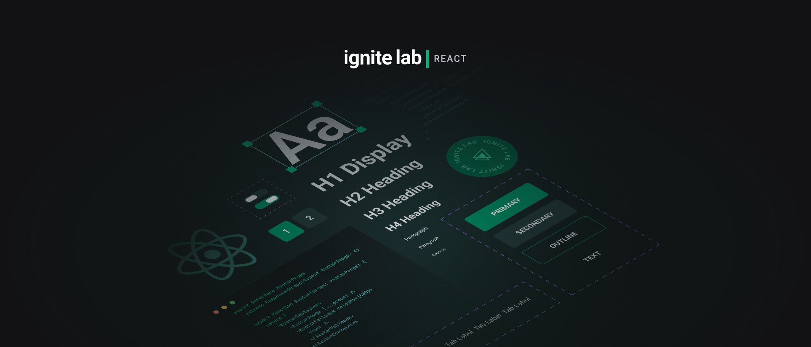
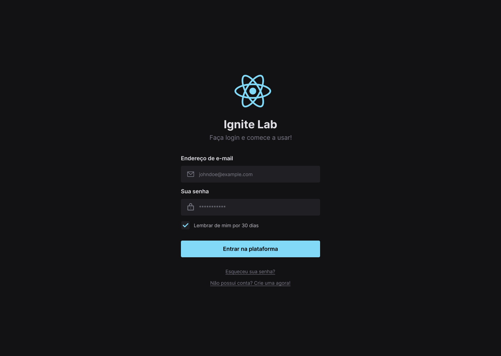

<div align="center">
   
   <br/><br/>
   <div align="center">
   
   
   
   
   
   
   <a href="https://github.com/ErickSilva2605/rocketseat-ignite-lab-design-system/commits/main">
      
   </a>
   <a href="https://github.com/ErickSilva2605/rocketseat-ignite-lab-design-system/issues">
      
   <a/>
   <a href="https://github.com/ErickSilva2605/rocketseat-ignite-lab-design-system/pulls">
      
   </a>
      <a href="https://github.com/ErickSilva2605/rocketseat-ignite-lab-design-system/blob/main/LICENSE">
      
   </a>
</div>
<br/><br/>
   <h1 align="center">[Ignte Lab] Design System: Do Figma ao React</h1>
</div>

<h2 align="center">Tópicos 📋</h2>

   <p>

- [Sobre 📖](#sobre-)
- [Layout 🎨](#layout-)
- [Tecnologias 🛠️](#Tecnologias-)
- [Features 📋](#Features-)
- [Primeiros Passos 🚀](#primeiros-passos-)
- [Como Contribuir 💪](#como-contribuir-)
- [Licença 📝](#licença-)

   </p>

---

<h2 align="center">Sobre 📖</h2>

<p align="center">
   Esse projeto foi desenvolvido durante o Ignite Lab 3, um evento online produzido pela <a href="https://github.com/Rocketseat">Rocketseat</a>, durante os dias 10 a 14 de outubro de 2022.
   <br><br>
   Essa aplicação consiste em um Design System. Para isso, inicialmente foram desenvolvidos os componentes e suas variações no Figma, e em seguida implementados no código, utilizando o React e a ferramenta Storybook para a documentação dos componentes.
   <br/>
</p>

---

<h2 align="center">Layout 🎨</h2>

   <p align="center">
      
   </p>

   <p align="center">
      O Layout desenvolvido em conjunto com <a href="https://www.figma.com/@rocketseat">Rocketseat</a>, para acessar no Figma:

- <a href="https://www.figma.com/file/pqON9go61yA9ndTUcQzy6X/Ignite-Lab---Design-System?t=lIvMdOYqnD5ZTeds-1">Ignite Lab Design System</a> 🚀

   </p>

---

<h2 align="center">Tecnologias 🛠️</h2>

   <p>

- [**Figma**](https://www.figma.com/): ferramenta de prototipação e design de interfaces.

- [**React**](https://reactjs.org/): uma biblioteca JavaScript de código aberto com foco em criar interfaces de usuário (frontend) em páginas web. É mantido pelo Facebook, Instagram, outras empresas e uma comunidade de desenvolvedores individuais. É utilizado nos sites da Netflix, Imgur, Feedly, Airbnb, SeatGeek, HelloSign, Walmart e outros;

- [**TypeScript**](https://www.typescriptlang.org/): um super conjunto da linguagem JavaScript que fornece classes, interfaces e tipagem estática opcional. Utilizado em conjunto com React no frontend web;

- [**Vite.JS**](https://vitejs.dev/): ferramenta de construção para front-end moderna que oferece uma experiência de desenvolvimento mais rápida e mais eficiente;

- [**TailwindCSS**](https://tailwindcss.com/): um framework CSS muito flexível que permite criar rapidamente interfaces de usuário complexas e responsivas;

- [**Storybook**](https://storybook.js.org/): uma ferramenta voltada para o desenvolvimento de componentes de interface de usuário isolados, usada por empresas como GitHub, Dropbox, airbnb, Mozilla, entre outras;

- [**RadixUI**](https://www.radix-ui.com/): um conjunto de componentes React acessíveis, flexíveis e com baixo acoplamento, que podem ser usados ​​para construir interfaces de usuário complexas.

- [**Visual Studio Code**](https://code.visualstudio.com/): um editor de código-fonte desenvolvido pela Microsoft para Windows, Linux e macOS, recomendado para o desenvolvimento de aplicações web;

   </p>

---

<h2 align="center">Features ✨</h2>

- Criação de tokens personalizados no design system utilizando o TailwindCSS;
- Implementação do design pattern de composição no React (Compound Component);
- Documentação dos componentes e suas variantes no Storybook;
- CI/CD: configuração do deploy do Storybook por meio de um workflow do Github Actions para o Github Pages;
- Utilização do [storybook-addon-a11y](https://storybook.js.org/addons/@storybook/addon-a11y/) para testar os componentes em relação aos padrões de acessibilidade na web;
- Implementação de [testes de interações](https://storybook.js.org/docs/react/writing-tests/interaction-testing) automatizados utilizando a integração do **Jest** com o Storybook e o [Test Runner](https://storybook.js.org/docs/react/writing-tests/test-runner);
- Implementação de uma API Mock com o **Mock Service Worker** para simular requisições HTTP, por meio do [MSW Storybook Addon](https://github.com/mswjs/msw-storybook-addon);

---

<h2 align="center">Primeiros Passos 🚀</h2>

### Clone

   ```jsx
   git clone https://github.com/ErickSilva2605/rocketseat-ignite-lab-design-system.git

   cd rocketseat-ignite-lab-design-system
   ```

### Instalar as dependências

   ```jsx
   npm install
   ```

### Inicia o projeto

   ```jsx
   npm run dev
   ```

### Inicia a interface do Storybook

   ```jsx
   npm run storybook
   ```

### Executa os testes

   ```jsx
   npm run test-storybook
   ```

---

<h2 align="center">Como Contribuir 💪</h2>

   ```
   - Clone o projeto 

   - Cria uma nova branch com suas mudanças:
   $ git checkout -b my-feature

   - Salve suas mudanças e crie uma mensagem de commit falando o que fez:
   $ git commit -m "feature: My new feature"

   - Envie suas mudanças:
   $ git push origin my-feature
   ```

---

<h2 align="center">Licença 📝</h2>

<p align="center">
   Este repositório está sob licença MIT. Você pode ver o arquivo <a href="https://github.com/ErickSilva2605/rocketseat-ignite-lab-design-system/blob/main/LICENSE">LICENSE</a> para mais detalhes.
</p><br>

---

   >Esse projeto foi desenvolvido por **[@Erick Augusto](https://www.linkedin.com/in/erick-augusto-silva/)**, com os instrutores da **[Rocketseat](https://rocketseat.com.br/)**, no #IgniteLabDesignSystem.<br>
   Se isso te ajudou, dê uma ⭐, isso vai me ajudar também! 😉

---

<br>
<div align="center">

   [](https://www.linkedin.com/in/erick-augusto-silva/)

</div>
